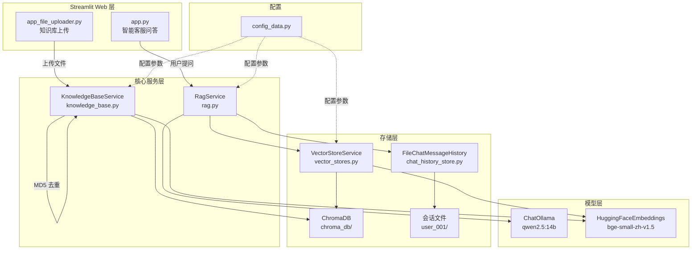
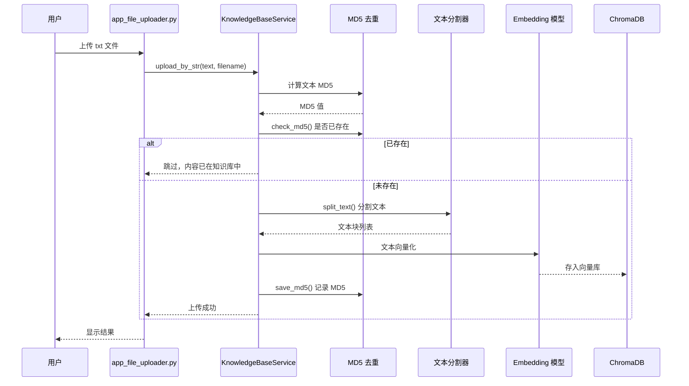
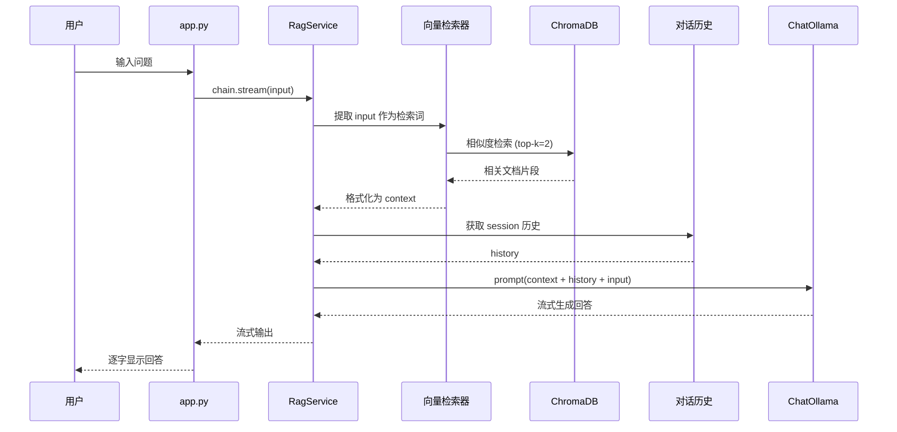

# 04_RAG项目 — 智能客服 RAG 系统

基于 LangChain + ChromaDB + Ollama 的检索增强生成（RAG）智能客服系统，提供知识库上传和智能问答两大功能，使用 Streamlit 作为 Web 界面。

## 目录结构

```text
04_RAG项目/
├── app.py                  # 智能客服问答 Web 应用（Streamlit）
├── app_file_uploader.py    # 知识库文件上传 Web 应用（Streamlit）
├── rag.py                  # RAG 核心服务，构建检索-生成链
├── vector_stores.py        # 向量存储服务，封装 ChromaDB 检索器
├── knowledge_base.py       # 知识库管理，处理文本入库、MD5 去重
├── chat_history_store.py   # 对话历史持久化（基于文件的消息存储）
├── config_data.py          # 全局配置（模型、分割参数、向量库等）
├── data/                   # 知识库原始数据
│   ├── 尺码推荐.txt
│   ├── 洗涤养护.txt
│   └── 颜色选择.txt
├── chroma_db/              # ChromaDB 持久化存储（运行后生成）
└── user_001/               # 用户会话历史存储（运行后生成）
```

## 架构图



## 数据流

### 离线流程（知识库上传）



### 在线流程（智能问答）



## 启动

### 前置要求

- Python 3.10+
- Ollama 已安装并运行，且已拉取 `qwen2.5:14b` 模型
- HuggingFace Embedding 模型 `BAAI/bge-small-zh-v1.5` 可自动下载

### 安装依赖

```bash
pip install streamlit langchain langchain-ollama langchain-chroma langchain-huggingface
```

### 1. 启动知识库上传服务（先上传知识）

```bash
cd 04_RAG项目
streamlit run app_file_uploader.py
```

上传 `data/` 目录下的 txt 文件到向量库。

### 2. 启动智能客服问答

```bash
cd 04_RAG项目
streamlit run app.py
```

浏览器访问 `http://localhost:8501` 即可开始对话。
