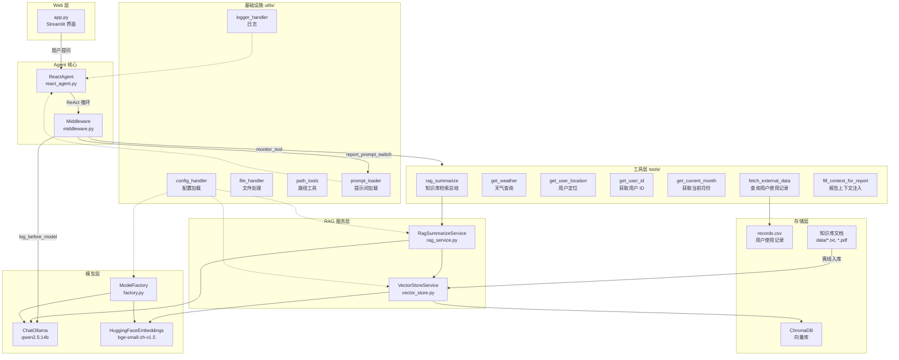
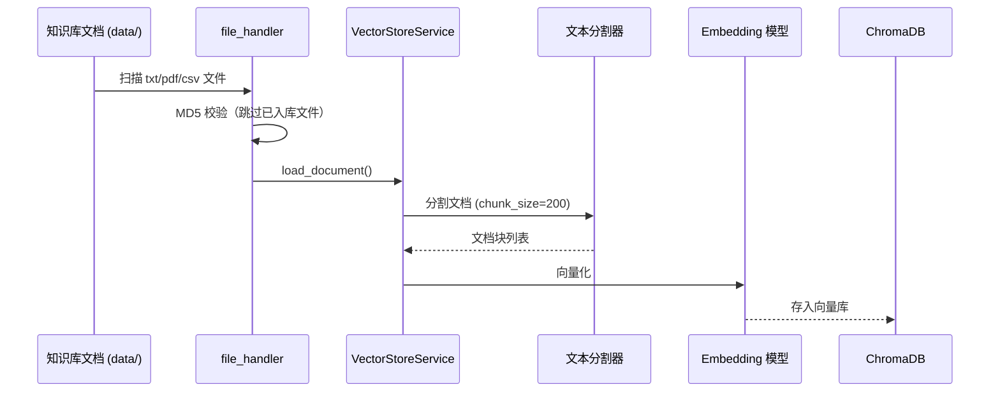
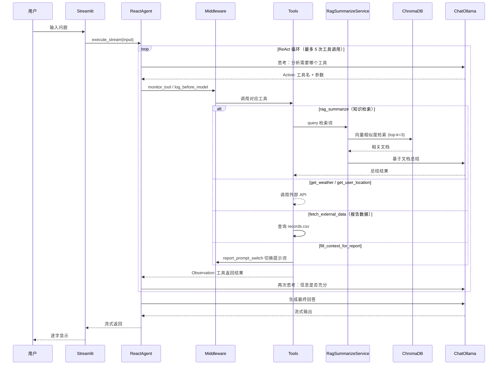

# 06_Agent项目 — 扫地机器人智能客服 Agent

基于 LangChain ReAct Agent 的扫地/扫拖一体机器人智能客服系统，具备知识库检索、天气查询、用户定位、个性化报告生成等多工具协同能力，使用 Streamlit 作为 Web 界面。

## 目录结构

```text
06_Agent项目/
├── app.py                        # Streamlit Web 入口（待开发）
├── agent/
│   ├── tools/
│   │   ├── agent_tools.py        # Agent 工具定义（待开发）
│   │   └── middleware.py         # 中间件（待开发）
│   └── react_agent.py           # ReactAgent 核心类（待开发）
├── rag/
│   ├── rag_service.py            # RAG 检索+总结服务（待开发）
│   └── vector_store.py           # 向量存储服务（待开发）
├── model/
│   └── factory.py                # 模型工厂（ChatOllama + HuggingFace Embedding）
├── config/
│   ├── rag.yaml                  # 模型配置（chat_model, embedding_model）
│   ├── chroma.yaml               # ChromaDB 配置（collection, chunk, 文件类型）
│   ├── prompts.yaml              # 提示词文件路径映射
│   └── agent.yaml                # Agent 配置（外部数据路径）
├── prompts/
│   ├── main_prompt.txt           # 主系统提示词（ReAct + 7 工具定义）
│   ├── rag_summarize.txt         # RAG 总结提示词
│   └── report_prompt.txt         # 报告生成提示词
├── data/
│   ├── 扫地机器人100问.pdf
│   ├── 扫地机器人100问2.txt
│   ├── 扫拖一体机器人100问.txt
│   ├── 故障排除.txt
│   ├── 维护保养.txt
│   ├── 选购指南.txt
│   └── external/
│       └── records.csv           # 用户使用记录（报告数据源）
├── utils/
│   ├── __init__.py               # 包标识
│   ├── path_tools.py             # 路径工具（项目根目录解析）
│   ├── config_handler.py         # YAML 配置加载器
│   ├── file_handler.py           # 文件处理（MD5、文档加载器）
│   ├── logger_handler.py         # 日志工具（控制台 + 文件双输出）
│   └── prompt_loader.py          # 提示词加载器
└── logs/                         # 日志输出目录（运行后生成）
```

## 架构图



## 数据流

### 离线流程（知识库构建）



### 在线流程（问答 / 报告生成）



## 启动

### 前置要求

- Python 3.10+
- Ollama 已安装并运行，且已拉取 `qwen2.5:14b` 模型
- HuggingFace Embedding 模型 `BAAI/bge-small-zh-v1.5`（首次运行自动下载）

### 安装依赖

```bash
pip install langchain langchain-ollama langchain-chroma langchain-huggingface \
            langchain-community streamlit pyyaml pypdf
```

### 1. 构建知识库（首次运行）

```bash
cd 06_Agent项目
python -m rag.vector_store
```

将 `data/` 下的文档向量化入库。

### 2. 启动 Web 应用

```bash
cd 06_Agent项目
streamlit run app.py
```

浏览器访问 `http://localhost:8501` 开始与扫地机器人智能客服对话。
