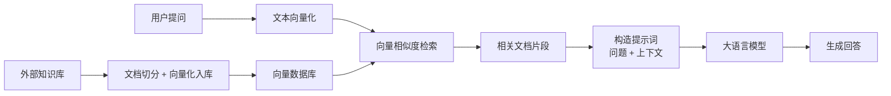
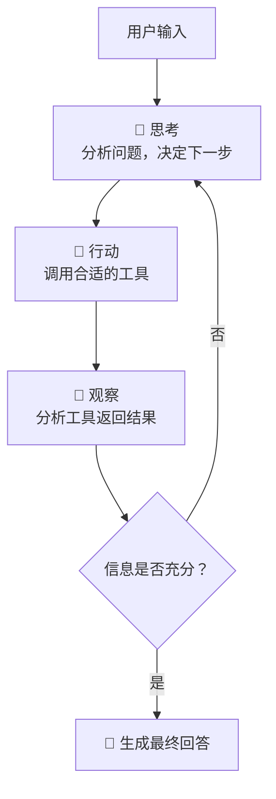

# RAG & Agent 学习项目

从基础到实战，系统学习检索增强生成（RAG）与智能体（Agent）技术的完整项目集。涵盖 OpenAI API 调用、提示词工程、LangChain 全链路开发，以及两个完整的工程化项目。

## 目录结构

```text
RAG/
├── 00_RAG_Overall/             # RAG 整体概览与初步实验
├── 01_OpenAI库基本使用/         # OpenAI API 基础调用（含本地 Ollama）
├── 02_提示词优化/               # 提示词工程实践
├── 03_LangChain RAG开发/       # LangChain 全链路学习（28 个示例）
├── 04_RAG项目/                 # 🔶 RAG 工程化项目 — 智能客服系统
├── 05_Agent/                   # Agent 基础学习（ReAct、中间件等）
├── 06_Agent项目/               # 🔶 Agent 工程化项目 — 扫地机器人客服
├── docs/                       # 文档与架构图资源
└── requirements.txt            # 全局 Python 依赖
```

## 模块说明

| 模块 | 内容 | 关键技术 |
|------|------|----------|
| **00_RAG_Overall** | ChromaDB 向量库、知识库加载、Prompt 测试 | LangChain, ChromaDB, OpenAI |
| **01_OpenAI库基本使用** | API 调用、历史对话管理、本地 Ollama 接入 | OpenAI SDK, Ollama |
| **02_提示词优化** | 金融文本澄清、JSON 结构化输出、信息提取与匹配 | Prompt Engineering |
| **03_LangChain RAG开发** | Chain 构建、Embedding、Memory、向量检索、Runnable 等 28 个专项示例 | LangChain 全组件 |
| **04_RAG项目** | 完整的智能客服 RAG 系统，含知识库上传与问答两个 Web 服务 | LangChain, ChromaDB, Streamlit |
| **05_Agent** | Agent 入门、流式输出、ReAct 推理模式、中间件机制 | LangChain Agent, LangGraph |
| **06_Agent项目** | 扫地机器人智能客服 Agent，支持多工具协同与个性化报告生成 | ReAct Agent, RAG, Middleware |

## 什么是 RAG

**RAG（Retrieval-Augmented Generation，检索增强生成）** 是一种将信息检索与大语言模型生成相结合的技术架构。

核心思路：大语言模型本身的知识存在时效性和领域局限性，RAG 通过在生成回答前，先从外部知识库中检索出与问题相关的文档片段，将其作为上下文注入到提示词中，让模型基于真实资料生成回答，而非仅凭预训练参数"编造"内容。



**RAG 解决的核心问题：**

- **知识时效性** — 模型训练数据有截止日期，RAG 可接入实时更新的知识库
- **领域专业性** — 通用模型缺乏特定行业知识，RAG 可注入企业私有文档
- **幻觉抑制** — 让模型基于真实资料回答，减少"一本正经地胡说八道"
- **可溯源性** — 回答可追溯到具体文档来源，便于验证和审计

## 什么是 Agent

**Agent（智能体）** 是具备自主推理和工具调用能力的 AI 系统。与传统的"问答式"大模型不同，Agent 能够根据用户需求自主规划执行步骤，选择合适的工具完成任务。

本项目采用 **ReAct（Reasoning + Acting）** 模式，Agent 按照"思考 → 行动 → 观察 → 再思考"的循环进行推理：



**Agent 与普通对话模型的区别：**

| | 普通对话模型 | Agent |
|---|---|---|
| **能力边界** | 仅能基于预训练知识回答 | 可调用外部工具扩展能力 |
| **执行方式** | 单轮输入→输出 | 多步推理，自主规划执行链路 |
| **信息来源** | 模型内部参数 | 知识库、API、数据库等外部资源 |
| **典型场景** | 闲聊、简单问答 | 复杂任务编排（检索 + 计算 + 生成报告） |

**本项目 Agent 具备的工具：**

- `rag_summarize` — 从知识库检索专业信息并总结
- `get_weather` — 查询城市实时天气
- `get_user_location` — 获取用户所在城市
- `get_user_id` / `get_current_month` — 获取用户身份与时间信息
- `fetch_external_data` — 查询用户使用记录
- `fill_context_for_report` — 注入报告生成上下文

## 技术栈

- **大语言模型**：Ollama（本地部署 qwen2.5:14b）
- **Embedding 模型**：BAAI/bge-small-zh-v1.5（HuggingFace）
- **框架**：LangChain / LangGraph
- **向量数据库**：ChromaDB
- **Web 界面**：Streamlit
- **语言**：Python 3.10+

## 快速开始

### 1. 环境准备

```bash
# 克隆项目
git clone <repo-url>
cd RAG

# 创建虚拟环境并安装依赖
python -m venv .venv
source .venv/bin/activate
pip install -r requirements.txt
```

### 2. 启动 Ollama 模型

```bash
ollama pull qwen2.5:14b
ollama serve
```

### 3. 运行项目

```bash
# 04_RAG项目 — 智能客服
cd 04_RAG项目
streamlit run app.py

# 06_Agent项目 — 扫地机器人客服（开发中）
cd 06_Agent项目
streamlit run app.py
```

详细说明请参阅各子项目的 README.md。
